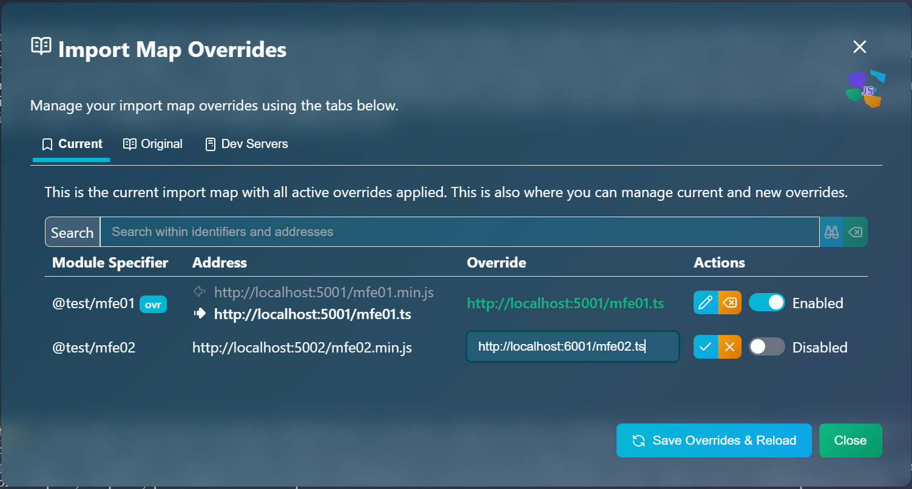

# &nbsp;CollageJS

> Micro library for framework-agnostic micro-frontends

*If you would like to express yourself, head to the [Discussions board](https://github.com/collagejs/collagejs/discussions).*

[Full Documentation](https://collagejs.dev)

[Packages & Repositories](https://collagejs.dev/docs/collagejs-packages-and-repositories)

*CollageJS* is a very, very small library that enables the composition of a web user interface with micro-frontends created with any technology (Svelte, React, Vue, SolidJS, HTMX, Lit, Ripple-TS, etc.).  It is heavily inspired by the *parcel* concept in the excellent `single-spa` routing library.

## For the `single-spa` Savvy

If you know/are used to `single-spa`, you're almost up to speed with *CollageJS*.  Basically, there's no concept of a "root config" project, but of course, there's always a "root" project.  Use whichever framework/technology you want to produce it.

Then the micro-frontends:  The concept doesn't exist.  At this point (after creating a root UI project), you just mount *CollageJS pieces* which are basically the equivalent of `single-spa` parcels.  You don't get a router provided, you bring your own, or don't bring a router.  No worries.  Who says that a router is required?  Not us.  You can trigger "parcel" loading by any means at your disposal:  Button clicks, timers, window events, and yes, also location URL changes (routing) if you want.  Just note that *CollageJS* is not a router library.

### Technical Differences

While `single-spa` asks you to shape your module exports in a particular way (the lifecycle functions), *CollageJS* imposes no such restriction.  It is just not necessary.  Just make sure you can get an object of type `CorePiece` to the `<Piece>` component of your preferred framework.  Then use your framework's marvels to make the `<Piece>` component appear or disappear.

> `CorePiece` is the name of the TypeScript interface that defines the main contract and defines the following lifecycle functions:  `mount`, `update` and `relocate`.

Yes, you'll still be working with import maps.  They are super handy.  We provide an enhanced (and simplified at the same time) version of `import-map-overrides` named `@collagejs/imo`.  It only supports the `overridable-importmap` type (and therefore only native import maps for native ES modules), but carries support for our `@collagejs/vite-aim` plug-in that lets you statically import from micro-frontends and auto-externalizes anything in the import map.  **That's right!  We are free from dynamic `import()` calls!**  We can statically import from micro-frontends.  Furthermore, it has a more modern user interface:

> 🌟 **Fun Fact**:  This user interface is a *CollageJS* piece.

#### Where Did the `unmount` Lifecycle Function Go?

In *CollageJS*, `CorePiece.mount()` returns the clean-up (unmounting) function.

#### And What About `bootstrap`?

Gone.  There's no equivalent in *CollageJS*, as experience with `single-spa` has demonstrated that is rarely needed, and if needed, one can do this initialization easily without having to impose the function requirement.  At least for now, there's no foreseeable future where an initialization function similar to `single-spa`'s `bootstrap()` will be defined.  But we agree:  *Never say NEVER*.
